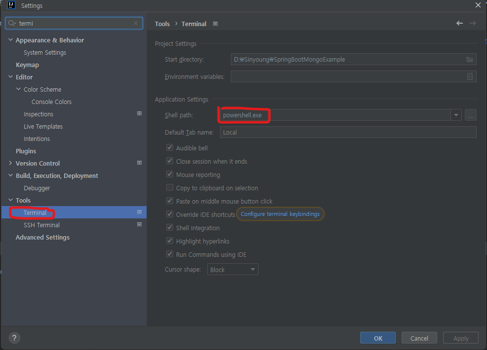
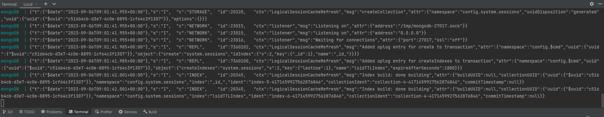
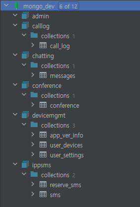

# SpringBootMongoExample
스프링부트에서 MongoDB사용 예제

# - Window환경에서 DockerCompose
1. window환경에서 도커를 설치 ( https://www.docker.com/products/docker-desktop/ )
2. 설치한 Doker Desktop을 실행
3. IntelliJ 터미널 환경이 powershell인지 확인
4. Terminal 탭에서 docker-compose up 명령어를 실행

## Spring 에서 MongoDB를 사용하는건 대표적으로 Repository 를 이용하는 방법과 MongoTemplate 을 이용하는 방법이 있다. 

근데 우리가 사용해야할 환경은 다음과같이 하나의 물리적인 몽고DB안에 여러개의 database가 존재하는 상황이다.

관련 내용은 https://recordsoflife.tistory.com/1224 를 보고 더 추가할 예정이다.

https://velog.io/@tekies09/SpringBoot-%EC%97%90%EC%84%9C-mongoDB-%EC%97%B0%EB%8F%99%ED%95%98%EA%B8%B0
https://gofnrk.tistory.com/38
