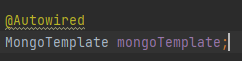
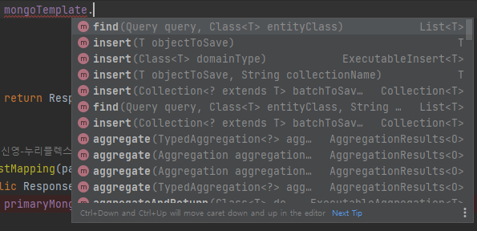
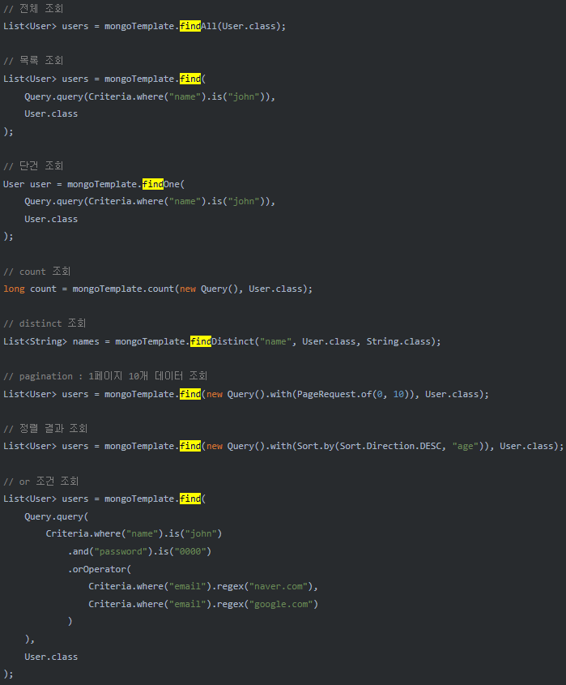
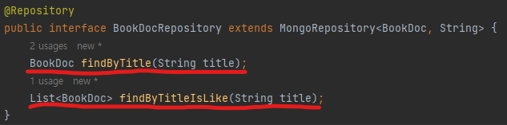
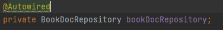
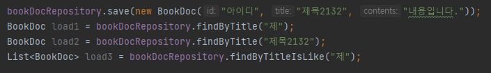
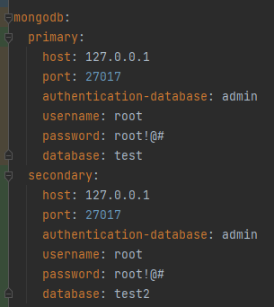
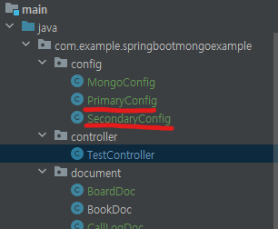
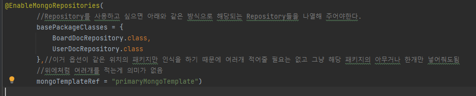

# SpringBootMongoExample
스프링부트에서 MongoDB사용 예제

- MongoDB는 모델(JPA에서의 Entity)들을 Document라고 부르고 이 Document로 CRUD를 할 수 있다.
- id를 주지 않고 insert를 하게되면 MongoDB자체적으로 _id 라는 이름의 id (ObjectId 타입)를 생성한다.

# - Window환경에서 DockerCompose
1. window환경에서 도커를 설치 ( https://www.docker.com/products/docker-desktop/ )
3. IntelliJ 터미널 환경이 powershell인지 확인
4. Terminal 탭에서 docker-compose up 명령어를 실행
5. (혹시 docker-compose up 명령어를 사용했는데 도커가 실행되지 않으면 설치한 Doker Desktop을 실행 후 다시 시도)

 
 

## Spring 에서 MongoDB를 사용하는 방법들
### 1. Template를 사용
- template을 사용하는 방법은 기본적으로 'spring-boot-starter-data-mongodb'에서 제공하는 MongoTemplate를 사용하면된다.\

이 MongoTemplate만을 사용해서 DB를 다룰경우는 따로 Repository가 없어도 상관이 없다.

MongoTemplate에서 기본적으로 제공하는 method를 사용해 insert,find 등이 가능하다.

 

- MongoTemplate을 이용한 find 예시

그림과 같이 사용하면 된다고 하는데 직접 해보니까 안된다.... multiDataBase환경에서 사용해서 그럴 수 도 있는데 이부분은 확인이 필요하다.

### 2. Repository를 사용
- repository를 사용하는 방법도 'spring-boot-starter-data-mongodb'에서 제공하는 MongoRepository를 상속받는 인터페이스를 생성해서 사용한다.

빨간색으로 밑줄친 부분처럼 JPA와 같은 방식으로 find, update등등 이 가능하다.

실직적으로 사용할 serviceLogic내에서 아래와같이 작성 후

아래처럼 저장이나 find등등 을 사용할 수 있다.

# 하나의 물리적인 몽고DB안에 여러개의 database가 존재하는 상황일경우.

위처럼 여러개의 DB(또는 스키마)로 나누어져 있는 DB를 접근해야 하는경우는 각각 DB에 해당하는 Config파일을 생성해 줌으로 인해서 사용 할 수 있는데 더 나은 방법이 존재하는 지는 모르겠다.

예를들어 2개의 DB(또는 스키마)를 사용하는 상황을 가정했을 때 \
"primary(예시에서 사용된 실제 DB명은 test이다.)와 secondary(예시에서 사용된 실제 DB명은 test2이다.)가 있다고 가정을 해보자"

proferties파일(또는 yml)에 각 접속에 대한 정보를 명시하고

밑줄친 두개의 config를 생성한다.

config파일에 적어둔 주석을 봐도 알수있겠지만
@EnableMongoRepositories 어노테이션의 basePackageClasses 옵션은 말그대로 해당 Config로 정해둔 DB를 사용할 Repository의 <b style="color:red;">'패키지'</b>를 명시해주는 거기 때문에 connection하려는 DB의 수 만큼 패키지를 만들어 주어야하고 해당되는 repository를 넣어주어야한다.

MongoDB + QueryDsl을 사용하는 방법은 이것저것 시도해 보았으나 아직 적용하지 못했다 https://gofnrk.tistory.com/119

TODO : 지저분한 코드 제거 및 테스트코드를 사용한 restApi 적용 예정 2023/09/07

TODO : Docker compose의 volume옵션을 사용한 개발환경 테스트 DB구성 적용 예정 2023/09/07

Multiple Database 관련 내용은 https://recordsoflife.tistory.com/1224 를 참고\
Spring에서 mongoDB연동은 https://velog.io/@tekies09/SpringBoot-%EC%97%90%EC%84%9C-mongoDB-%EC%97%B0%EB%8F%99%ED%95%98%EA%B8%B0 와\
https://gofnrk.tistory.com/38 를 참고했다.
